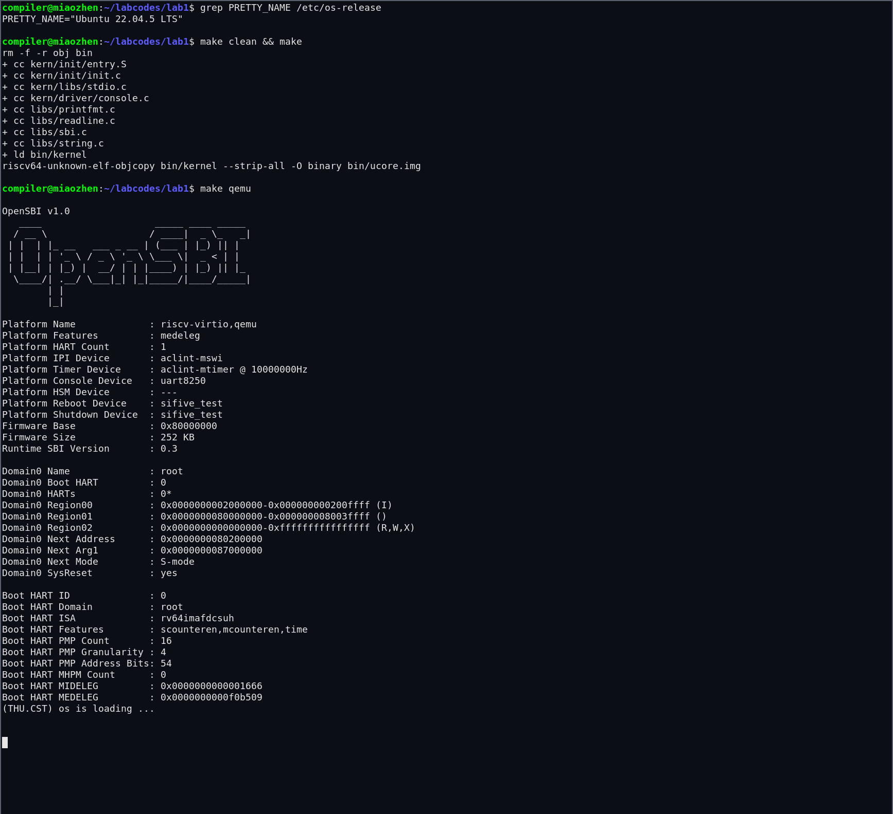
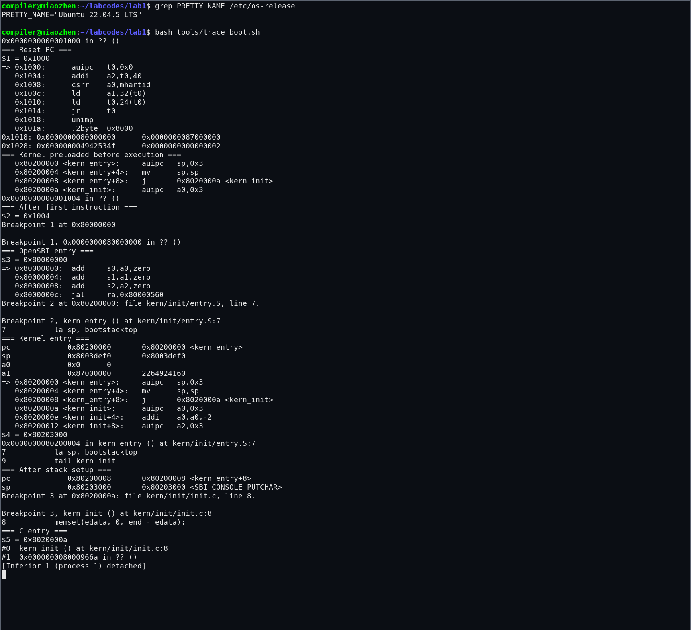

# 操作系统实验报告

## 实验基本信息

| 项目 | 内容 |
|------|------|
| **实验名称** | Lab 1：比麻雀更小的麻雀（最小可执行内核） |
| **小组人数** | 3 人 |
| **小组成员** | 刘宸旭（2414139，组长）、王子卓（2411070）、缪臻（2413807） |
| **完成日期** | 2026-09-29 |
| **报告材料更新日期** | 2026-10-08 |

### 小组分工

#### 练习分工

| 成员 | 负责的练习/模块 |
|------|----------------|
| 刘宸旭（2414139，组长） | 统筹 |
| 王子卓（2411070） | 练习一：理解内核启动中的程序入口操作 |
| 缪臻（2413807） | 练习二：使用 GDB 验证启动流程 |

#### 实验报告分工

本报告初稿使用 Codex 辅助，根据实验指导书、工程源码和实际调试结果整理。按小组已确认的分工，王子卓负责练习一对应的入口汇编分析部分，缪臻负责练习二对应的 GDB 启动流程验证部分，组长刘宸旭负责统筹。入口汇编分析以 `kern/init/entry.S`、链接脚本及反汇编结果为依据；启动流程分析以 QEMU 和 GDB 的实际输出为依据。

---

## 一、实验目的

本实验的主要目的是：

1. 理解 RISC-V `virt` 机器从复位、执行 OpenSBI 到进入 uCore 内核的完整启动流程，认识复位代码、固件和操作系统内核之间的分工。
2. 掌握使用链接脚本设置内核入口与内存布局的方法，理解 ELF 文件、裸二进制镜像、编译、链接和装载之间的关系。
3. 理解内核入口汇编建立启动栈并跳转到 C 语言入口函数的过程，掌握 `la sp, bootstacktop` 和 `tail kern_init` 的作用。
4. 学习使用 QEMU 与 GDB 进行远程调试，通过断点、单步、反汇编和寄存器检查验证内核启动过程。
5. 熟悉 AI 辅助阅读实验指导书、分析源码、定位环境差异和整理实验报告的基本方法。

---

## 二、实验环境

### 2.1 软件与硬件环境

| 项目 | 实际环境 |
|------|---------|
| 宿主系统 | Windows，使用 WSL 2 |
| Linux 环境 | Ubuntu 22.04 |
| 目标体系结构 | RISC-V 64 位 |
| 交叉编译器 | `riscv64-unknown-elf-gcc` 10.2.0 |
| 调试器 | `gdb-multiarch` |
| 模拟器 | `qemu-system-riscv64`，`virt` 机器 |
| 固件 | OpenSBI v1.0，Runtime SBI Version 0.3 |
| 工程目录 | `labcodes/lab1` |

报告截图对应 Ubuntu 登录环境中的 `/opt/qemu/bin/qemu-system-riscv64`（QEMU 7.0.0）。本机另有 `/usr/bin` 下的 QEMU 6.2.0（默认固件 OpenSBI v0.9）；启动前应使用 `command -v qemu-system-riscv64` 和 `--version` 核对实际使用版本。2026-10-07 在报告对应环境中重新完成编译、QEMU 输出和 GDB 启动/栈验证。

### 2.2 使用的 AI 工具

| 成员 | AI 编程工具 | 底层模型 | 备注 |
|------|------------|---------|------|
| 缪臻（2413807） | Codex 桌面应用 | GPT-5 | 本次协作使用；用于阅读实验文档、分析源码、执行编译与调试、整理报告初稿 |
| 王子卓（2411070） |  |  |  |
| 刘宸旭（2414139，组长） |

**说明：**本实验中的 AI 输出均结合源码和实际运行结果进行了核对。对于 QEMU 版本差异引起的启动问题，没有直接照搬指导书中的命令，而是根据 OpenSBI 输出和 GDB 结果定位原因并调整参数。

---

## 三、实验整体逻辑分析

### 3.1 本章节的逻辑主线

Lab 1 围绕“如何让一个最小操作系统内核在 RISC-V 虚拟机上运行”展开。内核在运行前不能自行完成装载和初始化，因此需要由 QEMU 模拟硬件复位，由复位 ROM 把控制权交给 OpenSBI，再由 OpenSBI 完成机器级初始化并进入位于 `0x80200000` 的内核入口。

内核自身还需要解决三个基础问题：一是通过链接脚本确定入口地址和各段布局；二是在汇编入口中建立可以支持 C 函数执行的栈；三是通过 SBI 服务输出字符，以确认内核已经成功运行。完成这些工作后，最小内核能够打印启动信息并进入无限循环，为后续中断、内存和进程管理实验提供基础。

本实验观察到的启动链如下：

```text
CPU 加电复位
    ↓ PC = 0x1000
QEMU 复位 ROM（MROM）
    ↓ 跳转到 0x80000000
OpenSBI 固件（M 模式）
    ↓ 初始化硬件环境并进入 0x80200000
kern_entry（S 模式内核入口）
    ↓ 建立内核栈
kern_init（C 语言入口）
    ↓ 清零 BSS、通过 SBI 输出
打印启动信息并进入无限循环
```

### 3.2 功能的逐步实现

1. **确定内核的装载地址和入口。** `tools/kernel.ld` 指定输出架构为 RISC-V、入口符号为 `kern_entry`，并从 `0x80200000` 开始安排 `.text`、`.rodata`、`.data` 和 `.bss`。只有先固定这些地址，固件和内核才能在同一个入口完成交接。
2. **生成可由 QEMU 装载的内核镜像。** Makefile 使用交叉编译器生成目标文件，链接为带调试信息的 `bin/kernel`，再通过 `objcopy` 得到 `bin/ucore.img`。ELF 文件便于链接和调试，裸镜像用于本实验的启动。
3. **建立内核栈并进入 C 代码。** `kern/init/entry.S` 预留两页栈空间，把 `sp` 设置为栈顶，然后使用尾跳转进入 `kern_init`。这是运行 C 函数和进行后续函数调用的前提。
4. **完成最小内核初始化和输出。** `kern_init` 将 `edata` 到 `end` 的 BSS 区域清零，通过 `cprintf → cons_putc → sbi_console_putchar → ecall` 输出启动信息，随后进入无限循环。
5. **使用 GDB 验证启动链。** 在 `0x1000`、`0x80000000`、`0x80200000` 和 `kern_init` 设置断点，通过 PC、SP、参数寄存器和反汇编结果验证每一步与预期一致。

补充实测：本次链接符号 `edata` 和 `end` 均为 `0x80203008`，因此 `memset` 的长度实际为 0，当前构建没有非空 BSS 区域需要清零。该语句保留了内核对零初始化区域进行初始化的通用逻辑。

### 3.3 主要文件与作用

| 文件或模块 | 作用 |
|------------|------|
| `tools/kernel.ld` | 规定内核入口、基地址和各段的内存布局。 |
| `Makefile`、`tools/function.mk` | 完成编译、链接、镜像生成、QEMU 启动和 GDB 连接。 |
| `kern/init/entry.S` | 定义 `kern_entry`，分配并设置内核启动栈，进入 `kern_init`。 |
| `kern/init/init.c` | 清零 BSS、输出启动信息并保持内核运行。 |
| `kern/libs/stdio.c`、`libs/printfmt.c` | 实现格式化输出和逐字符输出回调。 |
| `kern/driver/console.c` | 将内核控制台接口封装为 SBI 字符输入输出。 |
| `libs/sbi.c` | 按 SBI 调用约定设置寄存器并执行 `ecall`。 |

---

## 四、实验内容与实现

### 功能模块：最小内核的构建与启动

**统筹负责人：** 刘宸旭（2414139，组长）；练习一负责人为王子卓，练习二负责人为缪臻。

#### 模块功能描述

**涉及的主要入口和函数：**

```c
// kern/init/init.c
int kern_init(void) __attribute__((noreturn));

// libs/sbi.c
uint64_t sbi_call(uint64_t sbi_type,
                  uint64_t arg0,
                  uint64_t arg1,
                  uint64_t arg2);
void sbi_console_putchar(unsigned char ch);

// kern/driver/console.c
void cons_putc(int c);

// kern/libs/stdio.c
int cprintf(const char *fmt, ...);
```

内核入口及栈定义如下：

```asm
.globl kern_entry
kern_entry:
    la sp, bootstacktop
    tail kern_init

.section .data
    .align PGSHIFT
bootstack:
    .space KSTACKSIZE
bootstacktop:
```

该模块把固件交付的 CPU 执行环境转换为可执行 C 代码的内核环境。链接脚本保证 `kern_entry` 位于 `0x80200000`，入口汇编建立栈，`kern_init` 清零 BSS 并调用格式化输出函数。字符最终通过 SBI `ecall` 交给 OpenSBI 和虚拟串口，因此即使内核还没有完整设备驱动，也能输出调试信息。

#### 最终提示词

以下提示词根据本次协作目标和实际环境整理，供复现使用，并非历史输入的逐字记录：

````markdown
[GOAL]
阅读课程 Lab 1 指导书，在现有起始代码基础上完成最小可执行内核实验和实验报告。

[CONTEXT]
- 工程位于 labcodes/lab1。
- 运行环境为 Windows + WSL 2 Ubuntu 22.04。
- 使用 RISC-V 交叉编译器、QEMU 和 GDB。
- Lab 1 包含入口汇编分析和 GDB 启动流程验证两项练习。

[SPECIFICATION]
1. 阅读 entry.S、kernel.ld、init.c、SBI 和控制台输出代码，说明完整执行流。
2. 解释 la sp, bootstacktop 与 tail kern_init 的操作和目的。
3. 实际编译并运行内核，不能只根据指导书推测结果。
4. 使用 GDB 验证 0x1000、0x80000000、0x80200000 三个关键地址，记录 PC、SP 和反汇编结果。
5. 若指导书命令与本机 QEMU 版本不兼容，根据实际输出定位原因，并做最小范围修改。
6. 按课程实验报告模板整理报告，区分实测结果、原理分析和待填写的小组信息。

[OUTPUT]
- 可编译、可运行的 Lab 1 工程；
- 可复现 GDB 调试过程的脚本；
- Markdown 格式实验报告初稿。

[CONSTRAINT]
- 不虚构测试结果；
- 不修改与实验无关的源码；
- 所有关键结论应由源码、反汇编或运行输出支持。
````

#### 实现迭代过程

本模块经历了三次主要迭代。

##### 第一次迭代：建立目录并完成编译

**完成内容：**

- 按指导书创建 `labcodes/lab1`，复制课程提供的起始代码。
- 执行 `make`，成功编译所有 C 和汇编文件。
- 生成 `bin/kernel` 和 `bin/ucore.img`。

**结果：**编译通过，但按照原 Makefile 执行 QEMU 后只有 OpenSBI 信息，没有出现内核输出，需要继续定位启动参数问题。

##### 第二次迭代：解决当前 QEMU 版本的启动问题

**遇到的问题：**

原 Makefile 使用：

```make
-device loader,file=$(UCOREIMG),addr=0x80200000
```

在本机 OpenSBI v1.0 环境中，固件输出 `Domain0 Next Address : 0x0`，说明虽然镜像内容被放入内存，但固件没有得到有效的下一阶段入口，因此不会跳转到内核。

**问题解决策略：**

将 `qemu` 和 `debug` 目标改为使用：

```make
-kernel $(UCOREIMG)
```

修改后 OpenSBI 输出 `Domain0 Next Address : 0x80200000`，随后出现：

```text
(THU.CST) os is loading ...
```

这说明固件已正确把控制权交给内核。

##### 第三次迭代：适配调试器并自动记录启动流程

**遇到的问题：**本机安装了 `gdb-multiarch`，但没有 `riscv64-unknown-elf-gdb`，原 `make gdb` 命令不能直接使用。

**问题解决策略：**

- Makefile 优先查找 `riscv64-unknown-elf-gdb`，缺少时回退到 `gdb-multiarch`。
- 新增 `tools/trace_boot.sh`，自动启动暂停状态的 QEMU，连接 GDB，并依次检查复位地址、OpenSBI 入口、内核入口、栈设置和 C 入口。

**最终结果：**

- ✅ `make` 编译成功；
- ✅ QEMU 正确进入 `0x80200000` 并打印启动信息；
- ✅ GDB 实测启动链为 `0x1000 → 0x80000000 → 0x80200000`；
- ✅ 栈设置后 `sp = 0x80203000`，与 `bootstacktop` 一致；
- ✅ 成功进入 `kern_init`，其地址为 `0x8020000a`。

---

### 练习 1：理解内核启动中的程序入口操作

**负责人：** 王子卓（2411070）

#### 1. `la sp, bootstacktop` 完成了什么操作？目的是什么？

`la` 是“load address”伪指令。`la sp, bootstacktop` 将符号 `bootstacktop` 的地址装入栈指针寄存器 `sp`。由于完整地址通常不能编码在一条 RISC-V 指令中，本次反汇编显示它被展开为：

```asm
0x80200000 <kern_entry>:     auipc sp, 0x3
0x80200004 <kern_entry+4>:   mv    sp, sp
```

`entry.S` 中的 `bootstack` 使用 `.space KSTACKSIZE` 预留了内核栈空间。`KSTACKPAGE` 为 2，页大小为 4096 字节，因此栈大小为 8192 字节。`bootstacktop` 位于该空间的高地址一端，而 RISC-V 栈向低地址增长，所以它适合作为初始栈顶。

其目的是在进入 C 语言代码之前建立一个由内核管理的有效栈，使函数调用、局部变量和寄存器保存可以正常进行。GDB 实测进入内核时原 `sp` 为 `0x8003def0`，它仍指向固件使用的栈；单步执行 `la` 展开的两条指令后，`sp` 变为 `0x80203000`，与 `&bootstacktop` 完全一致。

#### 2. `tail kern_init` 完成了什么操作？目的是什么？

`tail kern_init` 是尾调用伪指令，本次被汇编为：

```asm
0x80200008 <kern_entry+8>:   j 0x8020000a <kern_init>
```

它直接把 PC 跳转到 `kern_init`，且不会像普通 `call` 那样把返回地址写入 `ra`。`kern_init` 被声明为 `noreturn`，函数末尾进入无限循环，不需要返回到 `kern_entry`，因此尾跳转既符合程序语义，也避免了没有意义的返回现场。其目的是在内核栈准备完成后，将执行流程交给 C 语言编写的内核初始化代码。

---

### 练习 2：使用 GDB 验证启动流程

**负责人：** 缪臻（2413807）

#### 1. 调试方法

自动复现实验可在工程目录执行：

```bash
make
bash tools/trace_boot.sh
```

手工调试时，可分别在两个终端中执行 `make debug` 和 `make gdb`。QEMU 的 `-S` 参数使虚拟 CPU 在执行第一条指令前暂停，`-s` 参数开放本机 1234 端口供 GDB 连接。

#### 2. 加电后的初始指令及作用

GDB 连接后观察到：

```text
$pc = 0x1000

0x1000: auipc t0,0x0
0x1004: addi  a2,t0,40
0x1008: csrr  a0,mhartid
0x100c: ld    a1,32(t0)
0x1010: ld    t0,24(t0)
0x1014: jr    t0
```

这些指令位于 QEMU `virt` 机器的复位 ROM。它们首先以 PC 相对方式取得复位代码附近的地址，把当前 hart ID 读入 `a0`，把设备树地址装入 `a1`，并准备其他启动参数；随后从 ROM 数据区取得固件入口地址并通过 `jr t0` 跳转。

检查 `0x1018` 附近的数据得到：

```text
0x1018: 0x0000000080000000  0x0000000087000000
```

其中 `0x80000000` 是 OpenSBI 入口，`0x87000000` 是本次启动使用的设备树地址。在 `0x80000000` 设置断点后继续执行，GDB 确实停在 OpenSBI 入口，证明复位 ROM 已完成第一次控制权交接。

#### 3. OpenSBI 到内核入口

在 `0x80200000` 设置断点并继续执行后，GDB 停在 `kern/init/entry.S:7`：

```text
pc = 0x80200000 <kern_entry>
sp = 0x8003def0
a0 = 0x0
a1 = 0x87000000
```

这里 `a0=0` 表示当前 hart ID，`a1` 保存设备树地址。执行栈初始化后观察到：

```text
pc = 0x80200008 <kern_entry+8>
sp = 0x80203000
```

继续运行后在 `kern_init` 断点停止：

```text
Breakpoint, kern_init () at kern/init/init.c:8
pc = 0x8020000a
```

因此本次实验实际验证出的执行路径为：

```text
0x1000（复位 ROM）
    → 0x80000000（OpenSBI）
    → 0x80200000（kern_entry）
    → 0x8020000a（kern_init）
```

#### 4. 关于内核镜像装载时机的补充观察

指导书建议使用 `watch *0x80200000` 观察内核加载瞬间。本机采用 `-kernel bin/ucore.img` 后，在 CPU 尚停于 `0x1000` 时，GDB 已能从 `0x80200000` 反汇编出 `kern_entry`。这说明在当前 QEMU 配置中，QEMU 在 CPU 开始执行前已经把内核镜像放入目标地址，并把下一阶段入口告诉 OpenSBI；OpenSBI 主要完成机器环境初始化和控制权交接。

因此，本环境中通过“复位时检查 `0x80200000` 内容 + 在 `0x80200000` 设置执行断点”的方式验证装载与跳转，比等待执行期间发生内存写入更符合实际行为。

---

## 五、测试与验证

### 5.1 编译测试

在 `labcodes/lab1` 执行 `make clean && make`，实际输出如下：

```text
+ cc kern/init/entry.S
+ cc kern/init/init.c
+ cc kern/libs/stdio.c
+ cc kern/driver/console.c
+ cc libs/printfmt.c
+ cc libs/readline.c
+ cc libs/sbi.c
+ cc libs/string.c
+ ld bin/kernel
riscv64-unknown-elf-objcopy bin/kernel --strip-all -O binary bin/ucore.img
```

生成的主要产物为：

- `bin/kernel`：包含符号和调试信息的 ELF 内核；
- `bin/ucore.img`：供 QEMU 加载的裸二进制内核镜像；
- `obj/kernel.asm`：反汇编结果；
- `obj/kernel.sym`：符号表。

### 5.2 QEMU 运行测试

执行 `make qemu` 后，OpenSBI 给出的关键信息为：

```text
Firmware Base             : 0x80000000
Runtime SBI Version       : 0.3
Domain0 Next Address      : 0x0000000080200000
Domain0 Next Mode         : S-mode
```

随后内核输出：

```text
(THU.CST) os is loading ...
```

输出后程序保持运行，符合 `kern_init` 末尾无限循环的设计。测试时使用 `timeout` 结束 QEMU，因此末尾出现由超时发送终止信号的信息不代表内核运行失败。

### 5.3 GDB 启动流程测试

`tools/trace_boot.sh` 的关键验证结果如下：

| 检查点 | 实测结果 | 结论 |
|--------|----------|------|
| 复位后 PC | `0x1000` | CPU 从 QEMU 复位 ROM 开始执行 |
| OpenSBI 入口 | `0x80000000` | 复位代码正确跳入固件 |
| 内核入口 | `0x80200000` | OpenSBI 正确进入 `kern_entry` |
| 栈顶符号 | `bootstacktop = 0x80203000` | 链接结果符合预期 |
| 设置后的 SP | `0x80203000` | `la sp, bootstacktop` 生效 |
| C 语言入口 | `kern_init = 0x8020000a` | 尾跳转正确进入 C 代码 |

本 Lab 1 起始工程没有提供 `tools/grade.sh`，因此没有可执行的 `make grade` 自动评分脚本。本报告采用完整编译、QEMU 启动输出和 GDB 断点跟踪三种方式完成验证。

### 5.4 测试结果截图

图 1 展示了从清理工程、重新编译到启动 QEMU 的完整结果。编译和链接均成功完成，OpenSBI 将下一阶段入口识别为 `0x80200000`，随后内核打印预期启动信息。



图 2 展示了 GDB 对启动流程的跟踪结果，包括复位地址、OpenSBI 入口、内核入口、栈指针设置以及进入 `kern_init` 的关键断点。



两张图片均在 Ubuntu 22.04 的独立 X11 会话中直接截取真实的 xterm 窗口。图 1 截取时 QEMU 和内核仍在运行，画面中可见 `Domain0 Next Address = 0x80200000` 和内核启动字符串；图 2 是实际执行 `tools/trace_boot.sh` 后的 GDB 终端画面。截图流程保存在 `tools/capture_ubuntu_screenshots.sh`，可重复运行并复核结果。

---

## 六、实验总结与收获

### 6.1 对操作系统的理解

#### 本实验的重要知识点

| 实验中的知识点 | 对应的 OS 原理 | 关系与差异 |
|----------------|---------------|------------|
| 复位 ROM、OpenSBI、内核依次执行 | 计算机启动与引导链 | 固件先于内核运行并准备硬件环境；本实验简化了真实机器中的 UEFI、引导程序和安全检查。 |
| M 模式进入 S 模式 | RISC-V 特权级 | OpenSBI 运行于更高特权级，内核运行于 S 模式；本实验尚未涉及 U 模式应用程序。 |
| 链接脚本指定 `0x80200000` | 程序链接、装载和地址空间 | 链接时确定符号布局，装载时必须满足地址约定；本实验尚未开启虚拟内存。 |
| `bootstack` 与 `sp` | 函数调用栈与内核栈 | 启动栈保证 C 代码可运行；它还不是按进程分配的内核栈，也没有用户栈。 |
| 清零 `.bss` | 可执行文件各段及运行时初始化 | `.bss` 只在 ELF 中记录大小，进入 C 环境前必须保证其内容为零。 |
| SBI `ecall` 输出字符 | 分层接口与特权边界 | 内核暂时借助固件服务访问控制台；后续实验会实现更完整的设备驱动和系统调用机制。 |
| ELF 转裸镜像 | 编译、链接与装载 | ELF 适合保存段和调试信息，裸镜像便于本实验直接装载；二者用途不同。 |
| QEMU + GDB 远程调试 | 内核调试技术 | 模拟器提供可观察、可重复的底层执行环境，适合查看物理地址和寄存器状态。 |

#### OS 原理中重要但本实验尚未涉及的内容

1. 中断、异常和时钟处理机制；
2. 物理页分配、页表与虚拟内存；
3. 用户态、系统调用和用户指针检查；
4. 进程与线程的创建、调度和上下文切换；
5. 同步互斥、死锁处理和多核并发；
6. 文件系统、磁盘驱动和缓存管理；
7. 权限隔离、资源回收和内核安全。

Lab 1 没有直接实现这些功能，但它建立了统一的启动、内存布局、输出和调试基础，后续模块都要在该基础上继续扩展。

### 6.2 AI 协作开发的经验

本次实验表明，AI 适合协助快速梳理跨文件调用关系、解释汇编伪指令并生成可重复的调试步骤，但结论必须通过实际工具验证。例如，仅依据指导书会认为 `-device loader` 能直接启动内核，而本机 OpenSBI 输出明确显示下一阶段地址为零。通过比较启动参数、观察 `Domain0 Next Address` 并设置入口断点，才能确认问题来自 QEMU/OpenSBI 版本差异，而不是内核源码本身。

在提示词中明确工程路径、运行环境、必须执行的验证步骤和“不得虚构结果”等约束，可以明显提高输出质量。对于汇编和启动流程，应要求 AI 同时给出源代码解释、反汇编结果和寄存器证据。这样得到的分析更容易复核，也能避免把伪指令描述和真实机器指令混为一谈。

本实验还说明，AI 生成的修改应保持最小范围。本次只调整了与本机工具环境相关的 QEMU 和 GDB 命令，并增加调试脚本，没有改动内核核心逻辑。后续实验中也应继续通过版本控制检查差异，并由小组成员理解每一处修改后再提交。

---

## 参考资料

1. [课程 Lab 1：练习](http://8.135.34.58/lab2026/_book/lab1/lab1_2_1_exercise.html)
2. [课程 Lab 1：项目组成和执行流](http://8.135.34.58/lab2026/_book/lab1/lab1_2_2_file.html)
3. [课程 Lab 1：GDB 调试工具使用体验](http://8.135.34.58/lab2026/_book/lab1/lab1_4_gdb.html)
4. [课程 Lab 1：实验报告要求](http://8.135.34.58/lab2026/_book/lab1/lab1_5_requirement.html)
